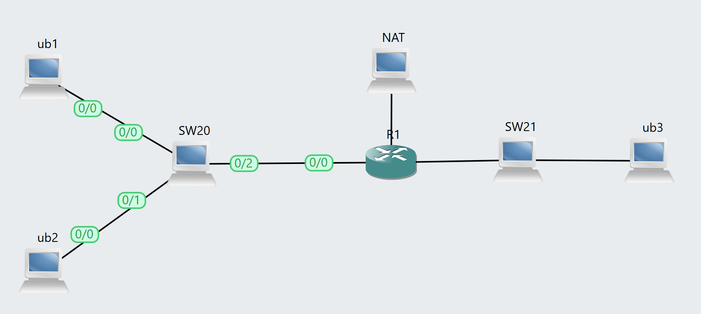
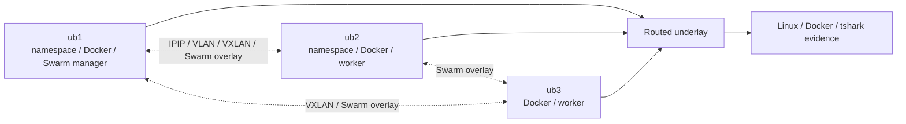

# Docker Network Containers Lab

A reproducible network-containers lab for Linux namespaces, IPIP tunnels, Docker macvlan/VLANs, multicast VXLAN, and Docker Swarm overlay networking.

[](.github/workflows/ci.yml)
[](https://www.gns3.com/)
[](#academic-context)

[!WARNING]
This repository documents controlled academic network-security lab work. Run the commands and scenarios only in isolated environments where you have authorization. Licensed appliance images, course handouts, raw packet captures, and local lab state are intentionally excluded.

## Overview

This repository packages the SAAR Lab 2.3 network-containers work as a practical container-networking project. It connects namespaces across hosts, validates VLAN-backed macvlan isolation, builds VXLAN overlays over a routed underlay, and analyzes Docker Swarm services and routing mesh behavior.

The repository is organized for public review: report source, architecture notes, selected evidence, CI-safe validation, and publication hygiene files are kept separate from generated or restricted lab artefacts.

## Academic Context

SAAR / Advanced Network Security and Architectures at Instituto Superior Tecnico. The lab focuses on Linux networking primitives, Docker network drivers, overlay encapsulation, service distribution, and packet-capture interpretation.

## Key Features

- Cross-host Linux namespace communication through IPIP tunnels.
- Docker macvlan networks backed by VLAN subinterfaces and isolation tests.
- Linux VXLAN overlays using multicast groups and routed underlay support.
- Docker Swarm replicated services, self-healing, scaling, routing mesh, and overlay VNIs.
- Command outputs and tshark summaries without raw packet captures.

## Architecture





See [docs/ARCHITECTURE.md](docs/ARCHITECTURE.md) for system boundaries, evidence flow, and publication caveats.

## Tech Stack

- Linux network namespaces
- IPIP
- Docker
- macvlan
- 802.1Q VLAN
- VXLAN
- Docker Swarm
- GNS3
- Wireshark / tshark
- PDF Report

## Repository Structure

```text
.
|-- docs/
|   |-- ARCHITECTURE.md
|   `-- report/
|-- evidence/
|-- scripts/
|   `-- check_repository.py
|-- .github/workflows/ci.yml
|-- CONTRIBUTING.md
|-- SECURITY.md
`-- README.md
```

- `docs/report/` - Final PDF report extract and selected figures.
- `docs/ARCHITECTURE.md` - Topology, evidence flow, and publication boundary.
- `evidence/` - Reviewed Linux, Docker, and capture-summary outputs.
- `scripts/check_repository.py` - Portable repository hygiene check.
- `.github/workflows/ci.yml` - CI-safe publication checks.

## Getting Started

Clone the repository and run the portable publication checks:

```powershell
python scripts/check_repository.py
```

Full lab reproduction requires a local GNS3 environment with the corresponding Cisco/Linux appliances and the original lab topology. Those resources are not redistributed here.

## Evidence Policy

Evidence under `evidence/` is curated and text-based where possible. Raw captures (`.pcap`, `.pcapng`), VM images, IOS/ASAv images, GNS3 project IDs, large generated artefacts, and private course PDFs are not included. The report references course material instead of vendoring it.

## Security and Ethics

This is an authorized educational network-security project. Do not target third-party systems, production networks, or public infrastructure. See [SECURITY.md](SECURITY.md) for scope and reporting guidance.

## Limitations

- Full reproduction requires the original GNS3 Linux-node topology and Docker-capable hosts.
- Raw PCAP captures are excluded; text and CSV summaries are included.
- The repository documents lab execution rather than shipping Docker image layers or GNS3 appliances.

## Roadmap

- Extract reusable setup scripts for each exercise where safe.
- Add sanitized topology metadata and diagrams.
- Add local report rendering instructions.

## Usage Note

This repository is published as an academic portfolio and reproducibility artefact for SAAR laboratory work. Course guides, network appliance images, and third-party materials may be subject to separate terms.

## References

- [Instituto Superior Tecnico](https://tecnico.ulisboa.pt/)
- [GNS3](https://www.gns3.com/)
- [Wireshark](https://www.wireshark.org/)
- Project-specific lab guides and course slides are cited inside the report source.

## Topics

docker, networking, containers, vxlan, ipip, macvlan, vlan, swarm, linux-namespaces, gns3, academic-project
