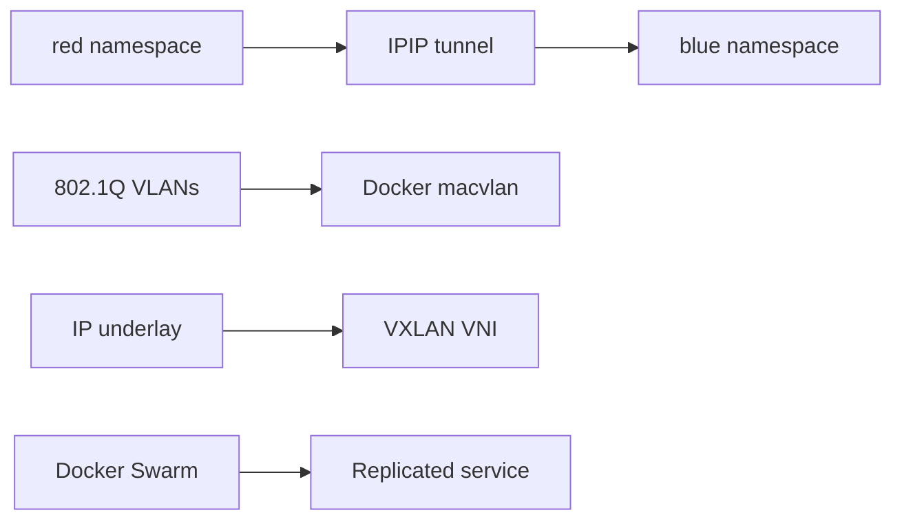

# Container Networking


Linux networking scripts for IPIP namespaces, VLAN-backed macvlan networks, multicast VXLAN overlays and Docker Swarm services.

> [!WARNING]
> These scripts create interfaces, routes, Docker networks and Swarm state. Run them only on an isolated Linux host.

## What it covers

- IPIP between Linux network namespaces.
- VLAN subinterfaces and Docker macvlan networks.
- Multicast VXLAN interfaces with macvlan endpoints.
- Docker Swarm initialization and replicated HTTP services.

## Topology


```mermaid
flowchart LR
RED["red namespace"] --> IPIP["IPIP tunnel"] --> BLUE["blue namespace"]
VLAN["802.1Q VLANs"] --> MACVLAN["Docker macvlan"]
UNDERLAY["IP underlay"] --> VXLAN["VXLAN VNI"]
SWARM["Docker Swarm"] --> SERVICE["Replicated service"]
```

See [docs/ARCHITECTURE.md](docs/ARCHITECTURE.md) for packet paths and default networks.

## Layout

```text
scripts/     Linux networking setup and experiment automation scripts
docs/        topology notes
evidence/    selected command and packet summaries
```

## Requirements

- Linux host with `iproute2`, Docker and root access.
- A dedicated parent interface for VLAN and VXLAN tests.
- An isolated Docker daemon for the Swarm scenario.

## Quick start

Create an IPIP namespace endpoint with explicit network values:

```bash
sudo env \
  NAMESPACE=red NAMESPACE_ADDRESS=10.10.10.1/24 HOST_ADDRESS=10.10.10.254/24 \
  TUNNEL_NAME=tun-red TUNNEL_ADDRESS=172.31.0.1/30 LOCAL_UNDERLAY=20.0.0.1 \
  REMOTE_UNDERLAY=20.0.0.2 REMOTE_NETWORK=10.20.20.0/24 \
  ./scripts/setup_ipip.sh
```

The remaining scripts expose their inputs through environment variables:

```bash
sudo PARENT_INTERFACE=eth0 ./scripts/setup_macvlan.sh
sudo PARENT_INTERFACE=eth0 BLUE_VTEP_ADDRESS=10.0.0.1/24 ./scripts/setup_vxlan.sh
sudo IMAGE=nginx:alpine REPLICAS=3 ./scripts/setup_swarm_service.sh

```

## Verification

- Ping the remote namespace through the IPIP tunnel.
- Inspect macvlan networks and verify VLAN separation.
- Inspect VXLAN interfaces, VNI values and multicast groups.
- Check `docker service ls`, task placement and the published service port.

## Safety

Use unique interface and Docker network names when testing. Do not run these scripts on a shared or production Docker host. See [SECURITY.md](SECURITY.md).
